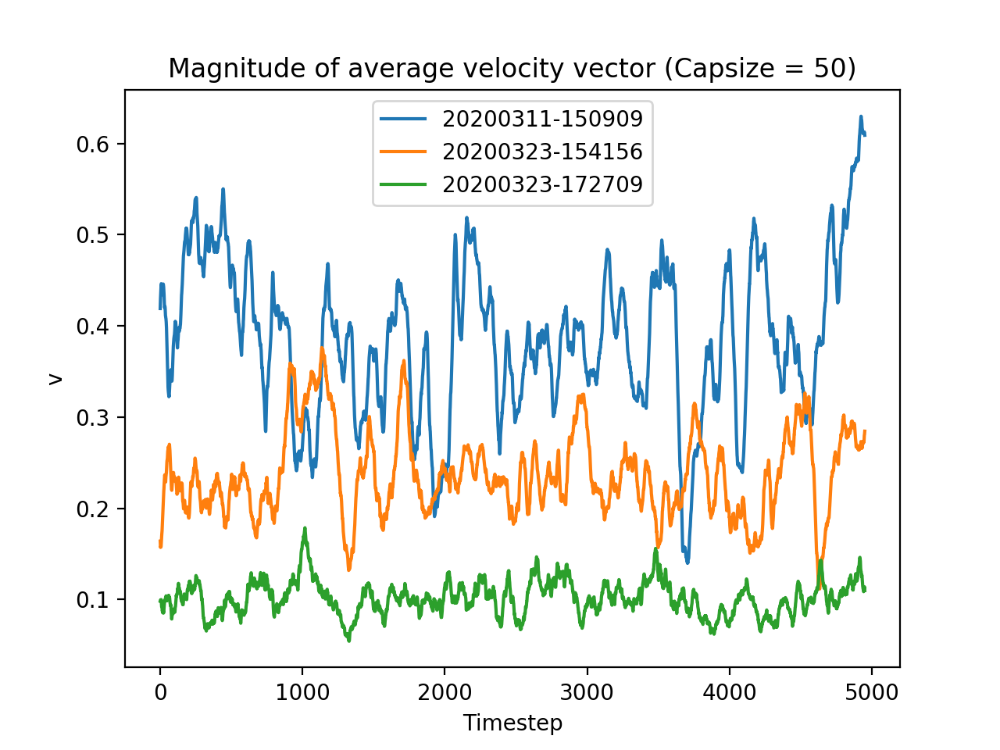
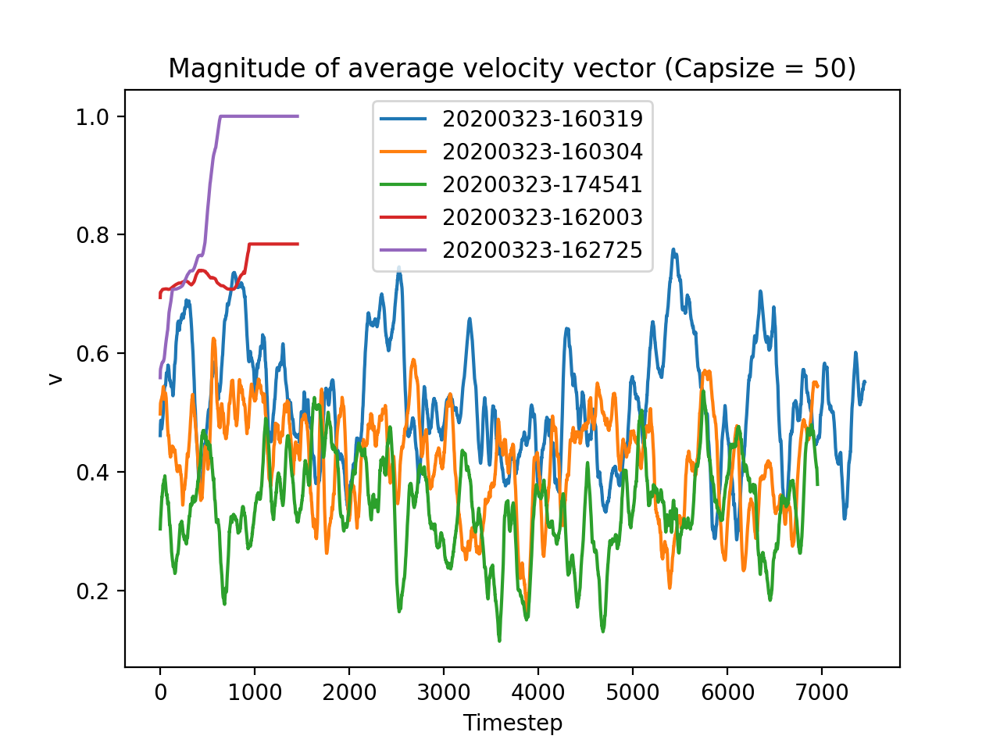
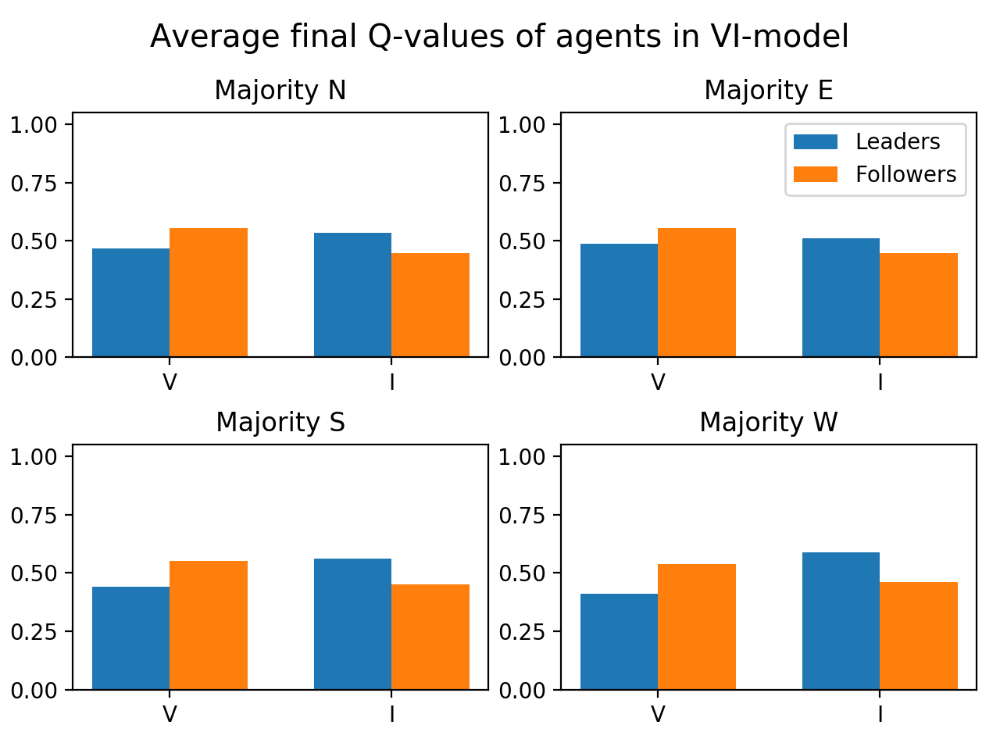
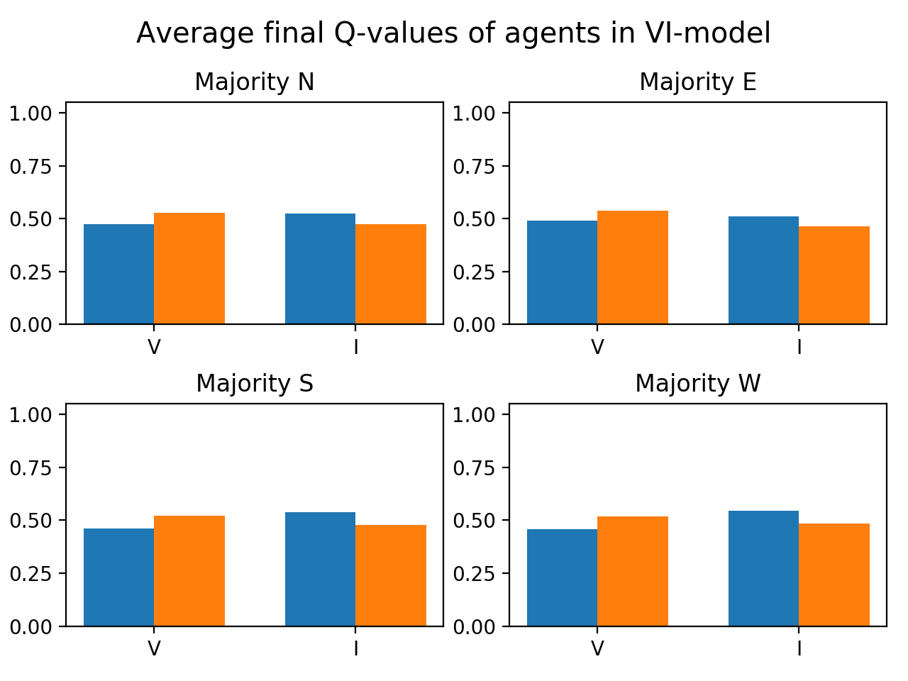
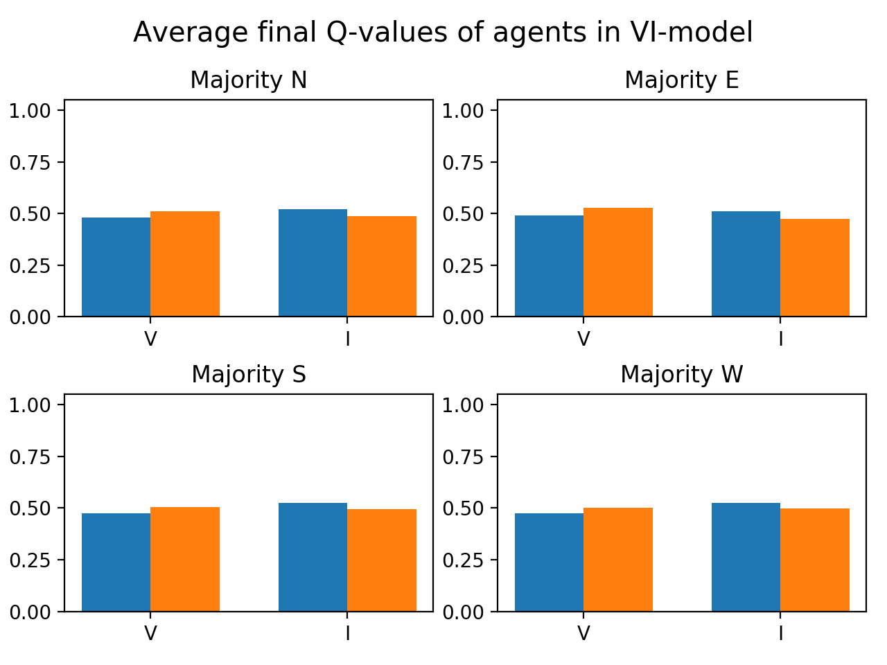
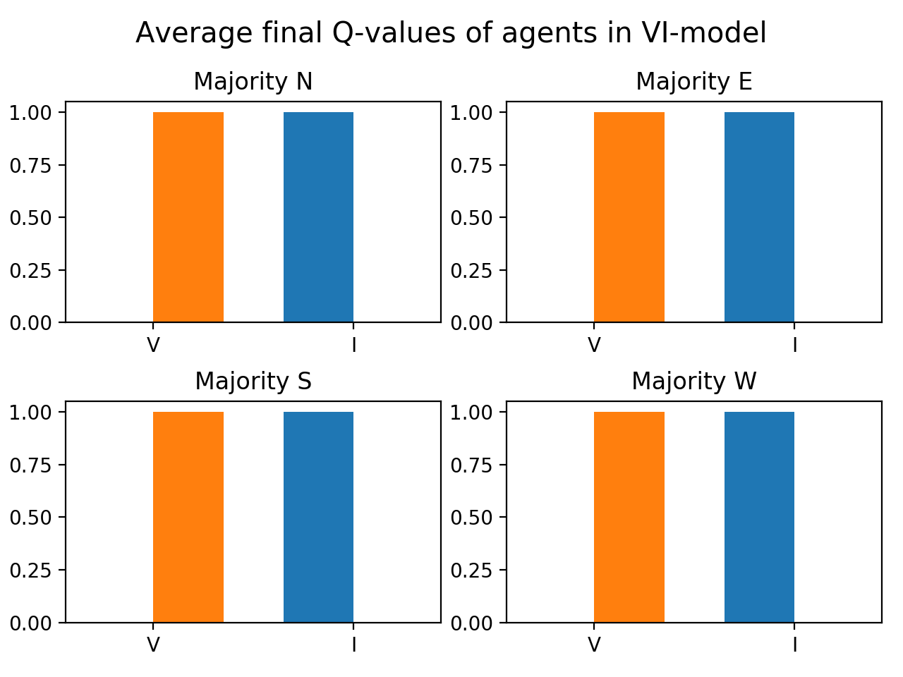
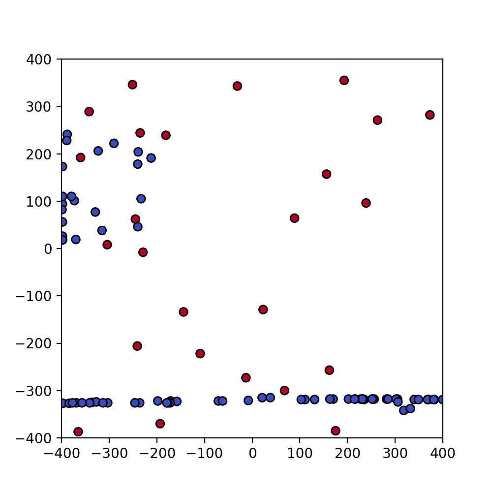

# Comparison of simulations with different ϵ

Three simulations are done with trained birds with an ϵ-greedy policy, with different values of epsilon. 20200311-150909 with ϵ = 0.2, 20200323-154156 with ϵ = 0.5 and 20200323-172709 with ϵ = 0.9.

## Learning

The magnitude of v is plotted below during the learning process of the abovementioned simulations. One can see that they get more disordered for higher ϵ, which is to be expected, since the policies converge to (0.5, 0.5).

## Policy execution

Below simulations are plotted with the policies that are trained above (colors correspond to each other). On average, the simulations again get more disordered when epsilon is increased, although the difference does not seem to be very significant from this plot.

The explanation seems to be this: Although in all simulations there seems to be a slight preference for followers to perform V and leaders to perform I, this difference is observed to shrink for bigger ϵ. Thus the behavior is getting more chaotic. See the figures below, sorted by increasing epsilon. (Orange = followers, blue = leaders)

This is against my expectations: I thought that if Q-learning would somehow show the desired differences between leaders and followers, as the results of 20200311-150909 first showed, they should be amplified when we increase epsilon, i.e., allow for more exploration. Effort needs to be put in understanding why this difference occurs and why it decreases when epsilon increases.

NB: The desired policy should look like this:

## Problem in the ideal policies

Clustering of followers is a problem. Leaders maintain the same spreading, because they fly in a constant direction. But followers tend to cluster because they follow each other. When they do, they usually cannot be affected by leaders, since these cannot change the direction of the majority. See for example the green line above (simulation 20200323-162003), where the followers where observed to collectively fly north, while the leaders kept flying east. Possibly adding more flight directions might solve this problem, since this gives more room for a single agent to influence the general flight direction.

Also, there seems to be a problem related to the periodic boundaries, probably because the observations can suddenly change when crossing the border. Followers tend to cluster in one straight line. Below is a snapshot from 20200323-162003 where this happened at the bottom of the field. After a while, a collective movement towards the north happened.

