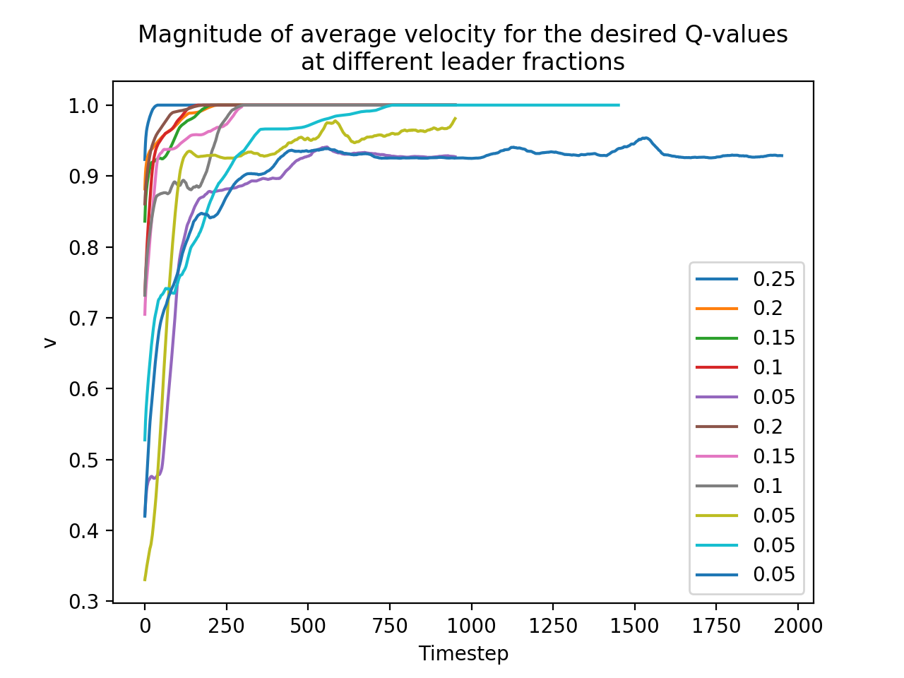
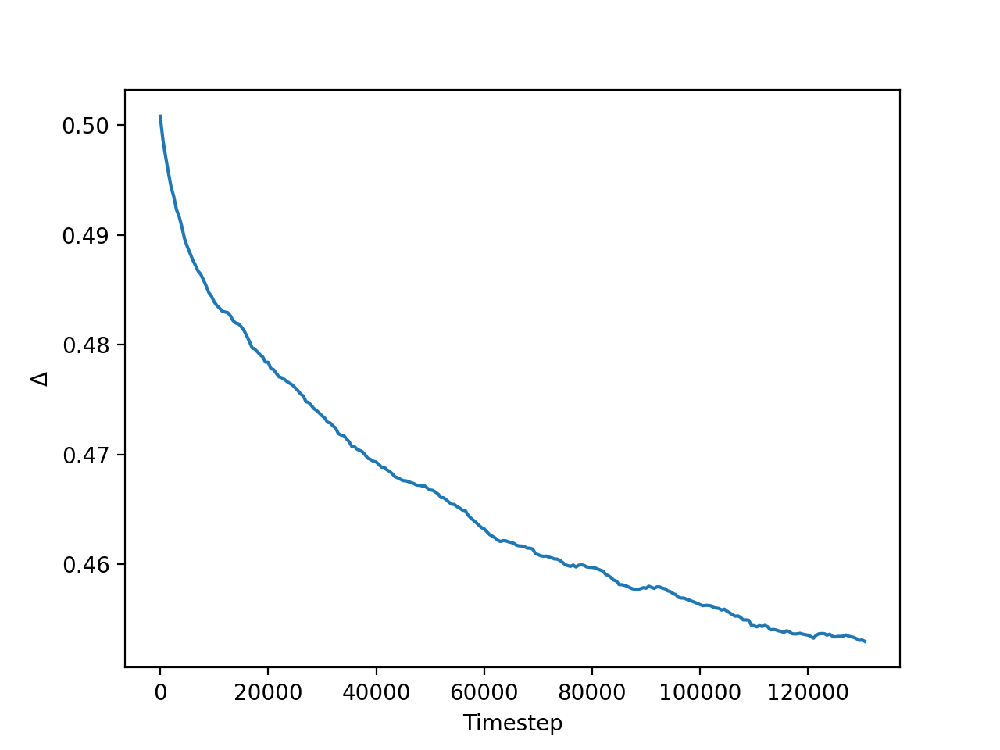
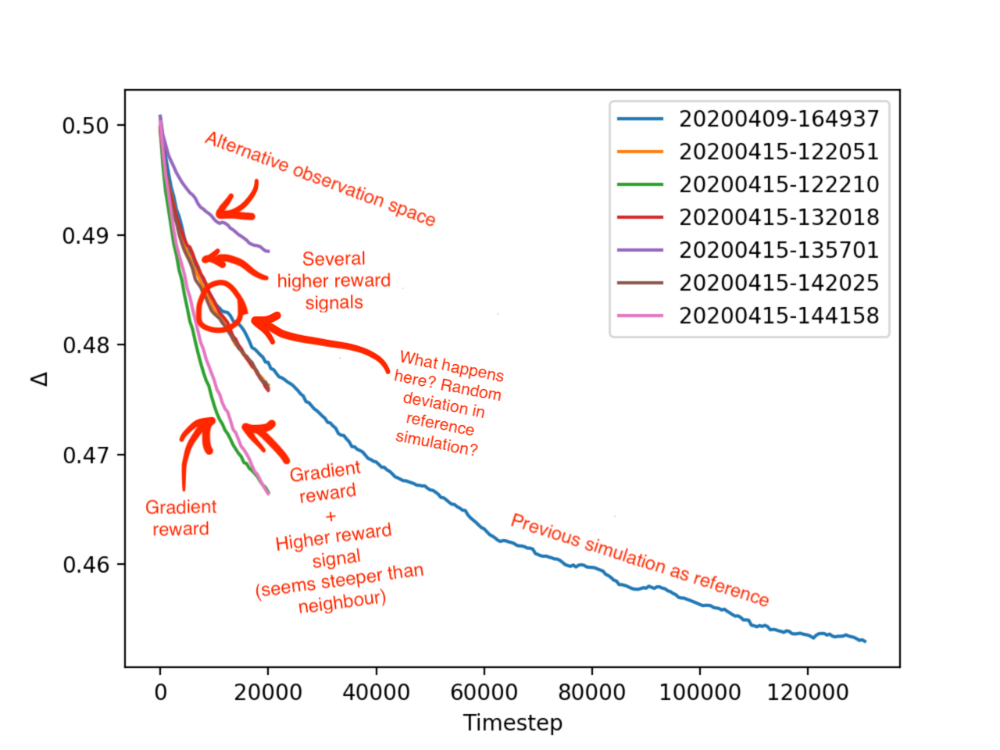

# Beating the learning curve

As previously noted, the desired policy in the VI-model is the one where all followers in each state choose to perform V (follow their neighbours), while the leaders always choose to follow their instinctive direction, which is eastward by definition.

Simulations have been done with this ideal policy for different leader fractions (= fraction of the bird population that are leaders). Below is the time evolution of the magnitude of the average velocity plotted. If this is equal to 1 the birds all fly in the same direction. It can be seen that even for surprisingly low leader fractions this happens very quickly. The simulations in which v = 1 did not happen (but might still happen when the simulation is ran for a longer time) all have a leader fraction of 0.05.

Two small remarks:
* This quantity is a magnitude, not a direction, but when v = 1 it is guaranteed that the birds fly eastward, since by construction the leaders always fly in this direction.
* For these results it is required that diagonal directions are introduced. This is because the Vicsek interaction often does not work properly due to the fact that the possible flight directions are too discretized. This was observerd [earlier](../20200323/observations.md#problem-in-the-ideal-policies).

## A measure for the quality of the policy

Since collective eastward behaviour is observed to happen with this policy (for leader fractions ≥ 0.1), this particular policy is what in literature is called an _optimal policy_ (Watkins & Dyan, 1992). This is because birds are rewarded for flying eastward, and an optimal policy is by definition the policy that maximizes the reward signal. Since the birds are always flying to the east, it is guaranteed that this policy yields the maximum reward. (NB: We here ignore the small time of ~ 200 timesteps that it takes to align.)

For this reason, it is good to have a quantity that measures how 'close' we are to this ideal policy. In Q-learning, the policy is directly determined by the Q-values. These Q-values are specific values for each state and action pair, and can thus be listed in a table. A partial example below, with vertically the observation states listed, and horizontally the actions:

|                                  |  V  |  I  |
|:--------------------------------:|:---:|:---:|
|`{'N': 0, 'E': 0, 'W': 0, 'S': 0}`| 4.3 | 8.1 |
|`{'N': 0, 'E': 0, 'W': 0, 'S': 1}`| 5.0 | 6.7 |
|`{'N': 0, 'E': 0, 'W': 0, 'S': 2}`| 8.9 | 8.8 |
|`{'N': 0, 'E': 0, 'W': 1, 'S': 0}`| 0.1 | 5.2 |
|                ...               | ... | ... |
|`{'N': 2, 'E': 2, 'W': 2, 'S': 2}`| 9.8 | 0.6 |

(NB: This example is oversimplified, since diagonal directions are now also included in the observation space, resulting in a space of size 3^8 = 6561) The bird then behaves such that it chooses for a given state the action that has the maximum Q-value. So when a bird in the above example observes `{'N': 0, 'E': 0, 'W': 1, 'S': 0}` (e.g. one bird flying to the west), it will choose to perform I (fly in its instincive direction). The goal of Q-learning is thus to obtain Q-tables that yield the maximum reward (we will not go into detail how this happens here).

With this in mind, we can create a measure for how close we are to the above defined optimal policy as follows: we count for each follower how many rows in its Q-table yield a maximum value for I (the action that is _not_ desired) and for each leader how many rows yield a maximum value for V. If we sum this up for all birds we end up with a number that is somewhere between 0 and the number of birds multiplied with the size of the observation space (in our case 100 * 6561 = 656,100). If we then divide this number by this maximum value, we end up with a quantity between 0 and 1 which we call Δ. The lower Δ is, the closer the Q-tables of the birds resemble the optimal Q-tables.

Since Q-learning is designed to converge towards the optimal policy, we might expect that this quantity Δ decreases when the birds are learning. Ideally one might also expect that it converges to 0. This is not guaranteed however, since there are a lot of parameters involved in the learning process, which usually have to be tweaked in order for an optimal result to come out of it. But, more importantly, this convergence is not guaranteed because Q-learning is designed for single agents in a predictable environment, which is not our use case: we have multiple simultaneously learning agents and hence an unpredictable environment. Although perhaps an argument might be made that the environment still is quite predictable because of it's relative simplicity, but this has to be investigated further.

This does not stop us from trying however, which is what I did. I performed a long simulation (approx. 6.5 hours on my laptop) with default parameters (consult [this](../20200409/parameters.json) file to find the relevant values) and tracked the evolution of Δ. The result is promising and is plotted below.

Note that Δ here starts at a value of around 0.5, which is to be expected, since the Q-tables are initialized with random variables. After that, the value of Δ steadily decreases, although very slowly (0.05 in 6.5 hours). Also, it might be the case that this simulation would have ultimately converged towards towards some non-zero value, maybe around 0.4.

## Optimizing the learning curve

We have come up with some optimizations that might lead to a steeper learning curve:
1. **Increase the reward signal.** This is 1 by default, but the algorithm is designed such that a higher reward signal (relative to the initial Q-values) is found quicker.
2. **Use a gradient reward system.** Rather than only rewarding flying to the east, one might also use a gradient reward system, that rewards the birds proportional to how much they are flying eastward. Concretely this means that the reward signal becomes _R *  cos(theta)_, where R is the maximum reward signal (1 by default) and theta the flight direction.
3. **Discretize observations differently.** Right now the birds observe either 0, 1 or 2 birds flying into a certain direction. When a larger number of birds is observed, the value is set to two. One might divide this differently, for example associate the value of 1 with 1, 2 or 3 birds and 2 with more than 4 birds.
4. **Use episodes which reset the environment.** This might introduce more randomness to the learning process and thus more change for exploration.
5. **Tweak the learning parameters alpha, gamma and epsilon.** These are internal parameters of the Q-learning algorithm and it is very common that have to be tweaked in order to optimize the learning process.

Of these, I have tried the first three today. The results can be seen below.

It seems that of all the optimizations performed, the gradient reward system is the most effective. Surprisingly, increasing the reward signal does not seem to do a lot. (The simulations showed here have R = 5, 10 and 20 but do not diverge from each other, though they do seem to diverge from the reference simulation at some point. It is unclear to me why though.)

Since the simulation with the gradient and boosted reward signal seems to be steeper than just the gradient signal, I chose to perform another long simulation with both of these adjustments. This simulation is still running as I type this.

Note that it might not be required for Delta to be exactly zero. For example, if leaders choose to follow their neighbours and the majority of neighbours are flying east, the behaviour is still desired while the policy is not equal to the ideal policy. Also, there might be some observation states that very rarely occur in practice (for example the observation `{'N': 2, 'E': 2, 'W': 2, 'S': 2}`, which stands for eight neighbouring birds, with two flying in each cardinal direction). And even if these states occur very briefly, they will probably not disturb the collective behaviour too much. It should to be investigated what the treshold of Delta is (and if there exists a clear treshold at all) above which the collective movement to the east breaks down. What is clear however, is that Δ = 0.45, the value that our first long simulation ended upon, is definitely not enough, as [a movie with these trained birds](../../movies/20200410-113110.mp4) shows.
