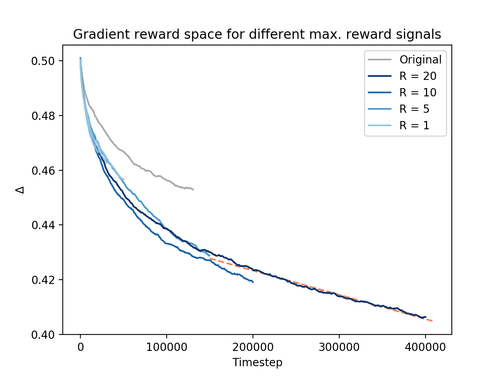

## A few quick observations based on new long simulation

Simulation 20200416-190443 is performed on rembrandt (my office PC), with two tmes as many timesteps as the previous (400,000). Started at april 16 19:04 and ended april 17 06:39, so in total it took aoround 11.5 hours. We chose for a gradient reward space and a maximum reward signal R = 20. The result is plotted below along with the other simulations using gradient rewards.

The results definitely show that increasing R does not have any significant effect on the learning curve. The previous simulation had R = 5 and seems to learn faster than this one, though the difference is not very big. The others also stay roughly on the same course. But what is clear is that the gradient reward system is a significant improvement, as can be seen from our reference simulation.

Interestingly, the tail looks a bit linear. I did a fit from timestep 175,000, which returned `Δ = -8.87e-08 * T + 0.44`. Might it keep going on this trend, this will mean that we will need around 4,960,541 timesteps, so more than 10 times this simulation length (which will thus take around 5 days). Of course it is uncertain how 
