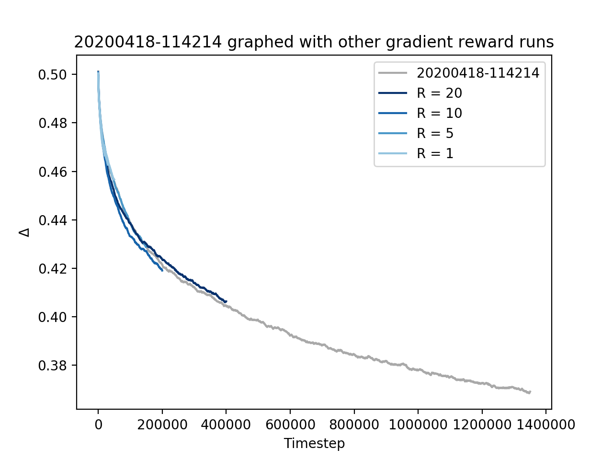
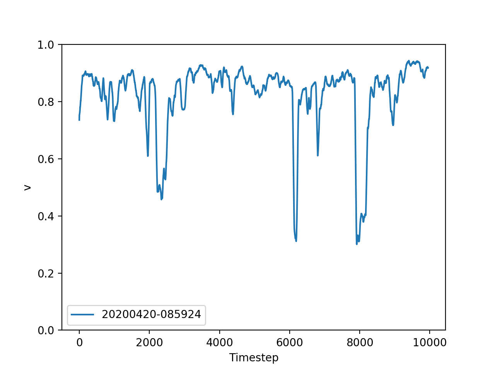

# Summary of the run over the past weekend

I ran simulation 20200418-114214 that started Saturday at 11:42 and ended this morning 3:29 (so it ran around 40 hrs) that looks very promising. Here is the evolution of Delta during this run, graphed along with previous long simulations that used a gradient reward system:

We can see that Δ keeps decreasing gradually, following the trend of previous runs. We also see even more clearly now that the maximum reward signal R does not have any significant effect to the simulations (NB: 20200418-114214 used R = 5).

Today I ran simulation 20200420-085924 with the fixed Q-values of the above trained birds. I graphed the evolution of v below:

Note that v here comes closer to 1 than any previous Q-learning simulation I have made. This is reflected in the behavior of the birds that can be observed in [the movie](../../movies/20200420-085924.mp4) I recorded simultaneously. Note that for example the drops in v in the above graph can be identified here.

It is important to get a better feel of Δ now. Is there a specific value of Δ below which v converges to 1? It looks like the current value, which is Δ = 0.369, might already be close to such a 'critical value', if it exists.
