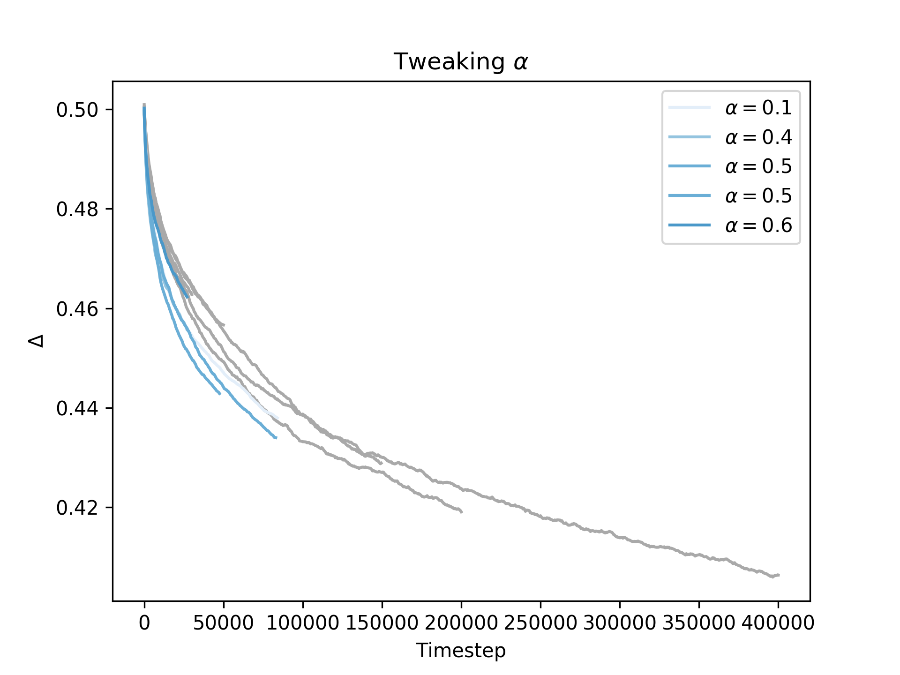
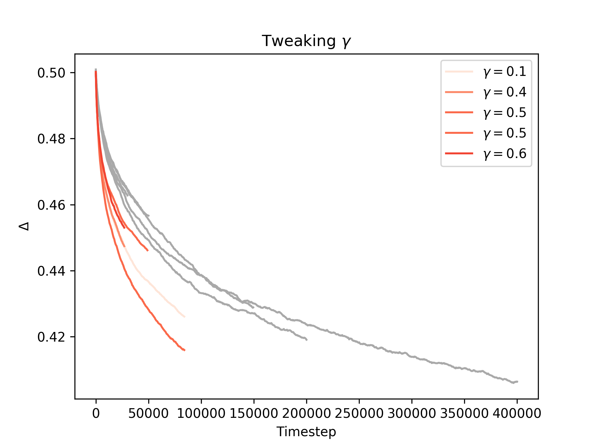
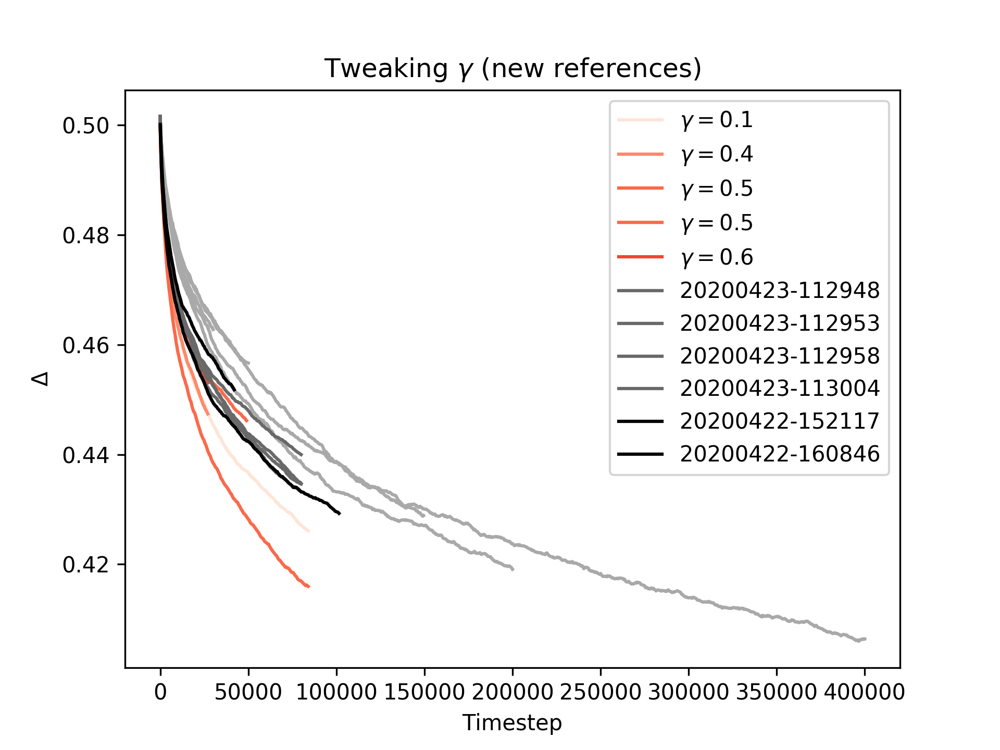
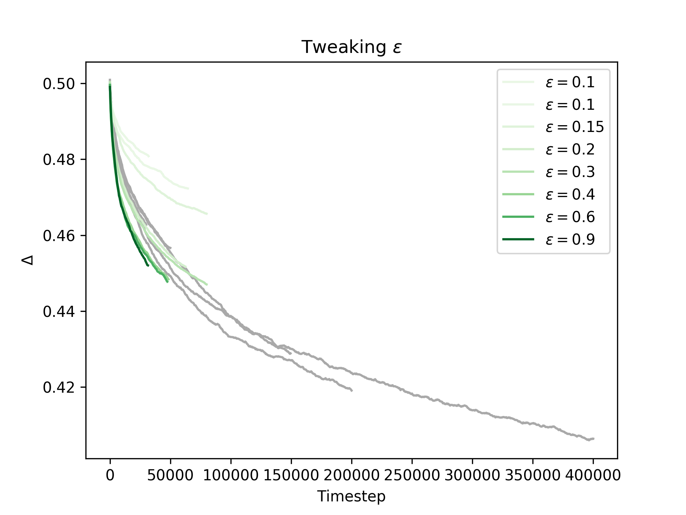

# Tweaking the learning parameters

In one figure a summary of all 20200422 runs:

Quite a mess, so let me break it down. All our previous simulations had learning parameters α = 0.9, γ = 0.9 and ε = 0.5. They are included in the above plot in Grey (the old [gradient runs](../20200420/observations.md), with the longest one excluded). We then ran a lot of other simulations where we tweaked the learning parameters one at a time. Each color in this graph corresponds to one of the three parameters. We will quickly define these parameters and then go through each set of results separately.

(NB: the two black lines are two new )

## Defining the parameters

For reference, here is the Q-learning formula from Wikipedia where α and γ appear and are named:

From this formula we can see that α, the learning rate, basically is a measure for how much the birds will update their Q-tables: when α = 0 they will stay constant, while when α = 1 the previous values will not play any role. (Thus it can be seen as some sort of 'memory', giving a weight to past values as opposed to the direct reward and future estimates).

As can be seen, γ is a measure for the relative weight of the estimate of the future value. Inserting this term will thus not only update the Q-values based on the direct reward r, but also the future reward. Since this again involves the Q-values, it recursively includes a term of the expected reward at further timesteps ahead, each with an additional factor γ. This is reflects the theoretical goal of reinforcement learning, which is maximizing the future reward signal . Thus γ can be interpreted as a term that weighs in long-term behaviour, and the higher gamma is, the more terms in this sum become significant.

In short we thus might say: α weighs in the past, and γ weighs in the future.

Finally, ε is the parameter controlling the exploration of the birds using an ε-greedy policy. While Q-learning aims towards a deterministic policy (such that in any given state the agent it is in, it chooses the action that yields the maximum value of its Q-table), but it can only do so by exploring different possibilities. ε defines the balance between exploration & following the optimal policy as follows: during the learning process, there is a chance of (1 - ε) that the agent will choose the action with the maximal Q-value, and a chance of ε that the agent will choose an action at random, in order to encourage the agent to discover new actions and adjust their Q-tables accordingly.

## Results for each parameter

### The learning rate α

### The discount factor γ

### The exploration paramater ε

