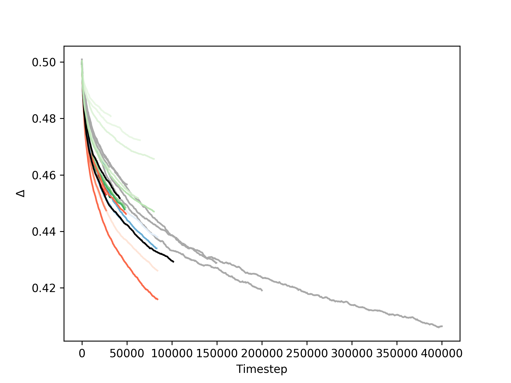

# Tweaking the learning parameters

In one figure a summary of all 20200422 runs:

Quite a mess, so let me break it down. All our previous simulations had learning parameters α = 0.9, γ = 0.9 and ε = 0.5. They are included in the above plot in Grey (the old [gradient runs](../20200420/observations.md), excluding the longest one).
